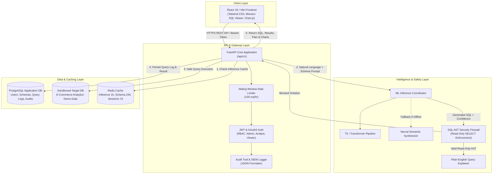

# Architecture Specification: Enterprise NLP to SQL Generator

## High-Level System Architecture

---

## 1. Request Lifecycle & End-to-End Flow

1. **User Prompt Ingestion**: The user inputs a natural language question (e.g. *"Show top 5 customers by total order amount in 2024"*) and selects a target database schema.
2. **Authentication & Rate Limiting**: The request arrives with an `Authorization: Bearer <JWT>` header. The sliding window rate limiter verifies the user hasn't exceeded 100 requests/hour.
3. **Caching Layer Check**: Redis checks key `inference:<schema_id>:<prompt_hash>`. On cache hit, cached SQL and chart recommendations are returned in `<10ms`.
4. **Prompt Engineering & Inference**: If cache miss, `PromptBuilder` formats table structures, primary keys, foreign keys, and column types into a structured Text-to-SQL context. The model generates the target SQL dialect.
5. **AST Security Firewall**: The AST parser decomposes the SQL statement:
   - Verifies the query begins with `SELECT` or `WITH`.
   - Rejects any DDL (`DROP`, `ALTER`, `CREATE`) or DML mutation (`DELETE`, `INSERT`, `UPDATE`, `TRUNCATE`).
   - Detects multi-statement injection `;` and comment evasion attacks.
6. **Execution Sandboxing**: Validated read-only queries run on the target database engine with execution timeouts and row bounds (default max 500 rows).
7. **Explainer & Chart Heuristics**: The explainer deconstructs joins, filter predicates, and aggregations into clear English bullet points. Visualization heuristics auto-detect appropriate chart modes (Bar, Line, Pie).
8. **Audit Trail Logging**: Query latency, token usage, row count, user IP, and timestamp are recorded to `audit_logs` and `model_metrics`.

---

## 2. Security Model & Defensive Architecture

- **Strict Read-Only Enforcement**: All queries executed against target databases must pass AST validation proving they are non-mutating `SELECT` statements.
- **SQL Injection Prevention**: Elimination of raw string concatenation. Parametric ORM bindings and AST token checks block subquery escapes, command execution (`xp_cmdshell`), and metadata exfiltration.
- **Role-Based Access Control (RBAC)**:
  - **Admin**: Full system telemetry, user role assignment, model monitoring, audit log inspection, query management.
  - **Analyst**: Natural language query generation, safe SQL execution, schema DDL upload, export to CSV/Excel/JSON, saving bookmarks.
  - **Viewer**: Read-only query execution, view-only charts and results grids.
- **Token Security**: Signed HS256/RS256 JWT tokens with sliding refresh rotation, bcrypt password hashing with automatic work-factor scaling.
