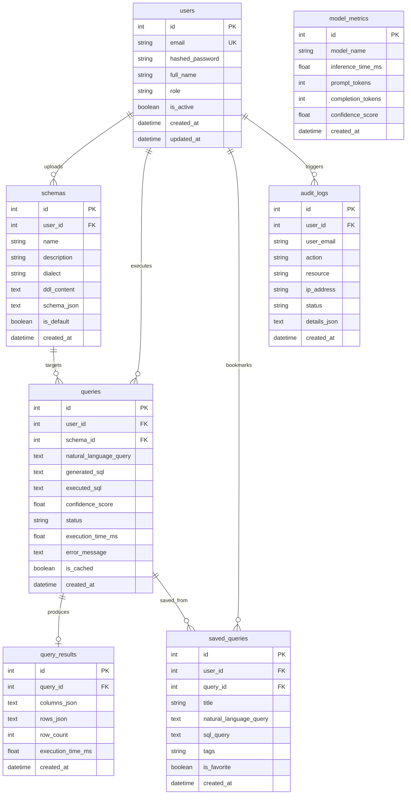
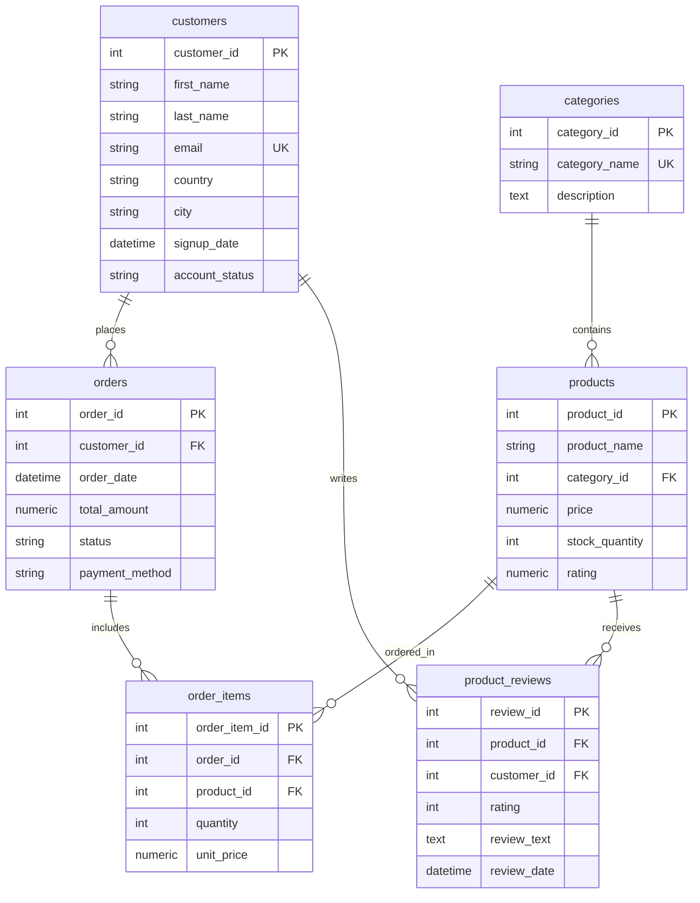

# Database Schema Architecture & ER Diagrams

## 1. Application Metadata Database (PostgreSQL)

```mermaid
erDiagram
    users ||--o{ schemas : "uploads"
    users ||--o{ queries : "executes"
    users ||--o{ saved_queries : "bookmarks"
    users ||--o{ audit_logs : "triggers"
    schemas ||--o{ queries : "targets"
    queries ||--o| query_results : "produces"
    queries ||--o{ saved_queries : "saved_from"

    users {
        int id PK
        string email UK
        string hashed_password
        string full_name
        string role
        boolean is_active
        datetime created_at
        datetime updated_at
    }

    schemas {
        int id PK
        int user_id FK
        string name
        string description
        string dialect
        text ddl_content
        text schema_json
        boolean is_default
        datetime created_at
    }

    queries {
        int id PK
        int user_id FK
        int schema_id FK
        text natural_language_query
        text generated_sql
        text executed_sql
        float confidence_score
        string status
        float execution_time_ms
        text error_message
        boolean is_cached
        datetime created_at
    }

    query_results {
        int id PK
        int query_id FK
        text columns_json
        text rows_json
        int row_count
        float execution_time_ms
        datetime created_at
    }

    saved_queries {
        int id PK
        int user_id FK
        int query_id FK
        string title
        text natural_language_query
        text sql_query
        string tags
        boolean is_favorite
        datetime created_at
    }

    audit_logs {
        int id PK
        int user_id FK
        string user_email
        string action
        string resource
        string ip_address
        string status
        text details_json
        datetime created_at
    }

    model_metrics {
        int id PK
        string model_name
        float inference_time_ms
        int prompt_tokens
        int completion_tokens
        float confidence_score
        datetime created_at
    }
```

---

## 2. Sandboxed Demo E-Commerce Database

```mermaid
erDiagram
    customers ||--o{ orders : "places"
    customers ||--o{ product_reviews : "writes"
    categories ||--o{ products : "contains"
    products ||--o{ order_items : "ordered_in"
    products ||--o{ product_reviews : "receives"
    orders ||--o{ order_items : "includes"

    customers {
        int customer_id PK
        string first_name
        string last_name
        string email UK
        string country
        string city
        datetime signup_date
        string account_status
    }

    categories {
        int category_id PK
        string category_name UK
        text description
    }

    products {
        int product_id PK
        string product_name
        int category_id FK
        numeric price
        int stock_quantity
        numeric rating
    }

    orders {
        int order_id PK
        int customer_id FK
        datetime order_date
        numeric total_amount
        string status
        string payment_method
    }

    order_items {
        int order_item_id PK
        int order_id FK
        int product_id FK
        int quantity
        numeric unit_price
    }

    product_reviews {
        int review_id PK
        int product_id FK
        int customer_id FK
        int rating
        text review_text
        datetime review_date
    }
```
