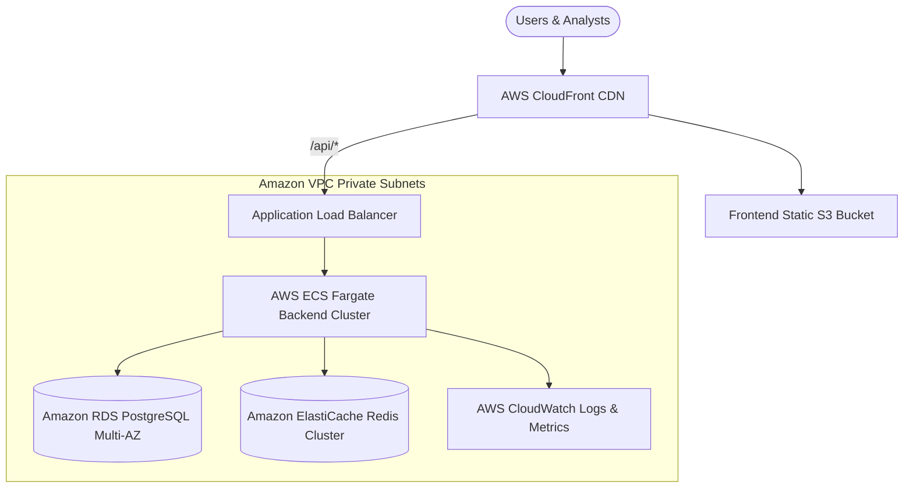

# Enterprise Deployment Guide

This document provides step-by-step instructions for deploying QueryCraft AI in production environments.

---

## Architecture Topology (AWS Production)



---

## 1. Quick Local Deployment (Docker Compose)

The easiest way to run the full stack locally is with Docker Compose:

```bash
# 1. Clone repository & configure environment
cp .env.example .env

# 2. Build and start containers
docker compose up --build -d

# 3. Verify health
docker compose ps
```

- Frontend: `http://localhost:3000`
- Backend API: `http://localhost:8000`
- Interactive Swagger: `http://localhost:8000/docs`

---

## 2. AWS Production Deployment Steps

### Step 1: Managed Database Setup (RDS & ElastiCache)
1. Provision **Amazon RDS for PostgreSQL** (PostgreSQL 15+, Multi-AZ, Storage Auto-scaling enabled).
2. Provision **Amazon ElastiCache for Redis** (Cluster mode enabled, multi-node replication).
3. Record connection endpoints into AWS Secrets Manager.

### Step 2: Container Registry (Amazon ECR)
```bash
# Authenticate Docker to ECR
aws ecr get-login-password --region us-east-1 | docker login --username AWS --password-stdin <aws_account_id>.dkr.ecr.us-east-1.amazonaws.com

# Build & Push Backend
docker build -t querycraft-backend:latest ./backend
docker tag querycraft-backend:latest <aws_account_id>.dkr.ecr.us-east-1.amazonaws.com/querycraft-backend:latest
docker push <aws_account_id>.dkr.ecr.us-east-1.amazonaws.com/querycraft-backend:latest

# Build & Push Frontend
docker build -t querycraft-frontend:latest ./frontend
docker tag querycraft-frontend:latest <aws_account_id>.dkr.ecr.us-east-1.amazonaws.com/querycraft-frontend:latest
docker push <aws_account_id>.dkr.ecr.us-east-1.amazonaws.com/querycraft-frontend:latest
```

### Step 3: ECS Fargate Task Definition
Configure environment variables using AWS Secrets Manager:
```json
{
  "family": "querycraft-backend",
  "networkMode": "awsvpc",
  "cpu": "1024",
  "memory": "2048",
  "containerDefinitions": [
    {
      "name": "backend",
      "image": "<aws_account_id>.dkr.ecr.us-east-1.amazonaws.com/querycraft-backend:latest",
      "portMappings": [{ "containerPort": 8000 }],
      "secrets": [
        { "name": "DATABASE_URL", "valueFrom": "arn:aws:secretsmanager:us-east-1:xxx:secret:DATABASE_URL" },
        { "name": "SECRET_KEY", "valueFrom": "arn:aws:secretsmanager:us-east-1:xxx:secret:SECRET_KEY" }
      ],
      "logConfiguration": {
        "logDriver": "awslogs",
        "options": {
          "awslogs-group": "/ecs/querycraft-backend",
          "awslogs-region": "us-east-1",
          "awslogs-stream-prefix": "ecs"
        }
      }
    }
  ]
}
```

---

## 3. Kubernetes / Helm Deployment Example

```yaml
apiVersion: apps/v1
kind: Deployment
metadata:
  name: querycraft-backend
  namespace: production
spec:
  replicas: 3
  selector:
    matchLabels:
      app: querycraft-backend
  template:
    metadata:
      labels:
        app: querycraft-backend
    spec:
      containers:
      - name: backend
        image: querycraft-backend:latest
        ports:
        - containerPort: 8000
        livenessProbe:
          httpGet:
            path: /api/health
            port: 8000
          initialDelaySeconds: 15
          periodSeconds: 20
        resources:
          limits:
            cpu: "1"
            memory: "2Gi"
          requests:
            cpu: "500m"
            memory: "1Gi"
```
